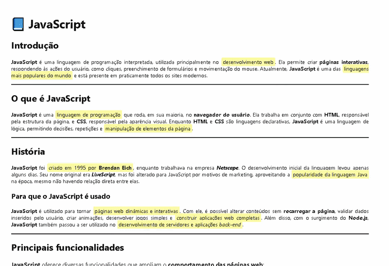

# 📘 Página estilo Wikipedia - JavaScript


## 🎬 Demonstração



## 🚀 Sobre o projeto

Este projeto é uma página web desenvolvida com **HTML, CSS e JavaScript**, com o objetivo de simular um artigo no estilo da Wikipedia, apresentando informações sobre a linguagem **JavaScript**.

## 🛠️ Tecnologias utilizadas

- HTML5  
- CSS3  
- JavaScript  

## 🎯 Funcionalidades

- 📄 Página informativa organizada por seções  
- 🎨 Estilização inspirada em páginas de documentação  
- 🌙 Alternância entre modo claro e modo escuro  
- 🔗 Links externos com efeito de hover  

## 💡 Como funciona o modo escuro

O modo escuro é implementado utilizando variáveis CSS (`:root`) e JavaScript, alternando uma classe no elemento `<html>` para modificar as cores da aplicação.

## 📁 Estrutura do projeto

📦 projeto-wikipedia  
 ┣ 📜 index.html  
 ┣ 📜 style.css  
 ┣ 📜 script.js  
 ┗ 📁 assets  
    ┗ 📷 demo.gif  

## ▶️ Como executar

```bash
git clone https://github.com/seu-usuario/seu-repositorio.git
Abra o arquivo index.html no navegador.
````

## 👨‍💻 Autor

**Daniel Neto**
🔗 https://github.com/D4nN3t0

## 📌 Observações
Projeto desenvolvido para praticar conceitos básicos de front-end como HTML, CSS e JavaScript.
